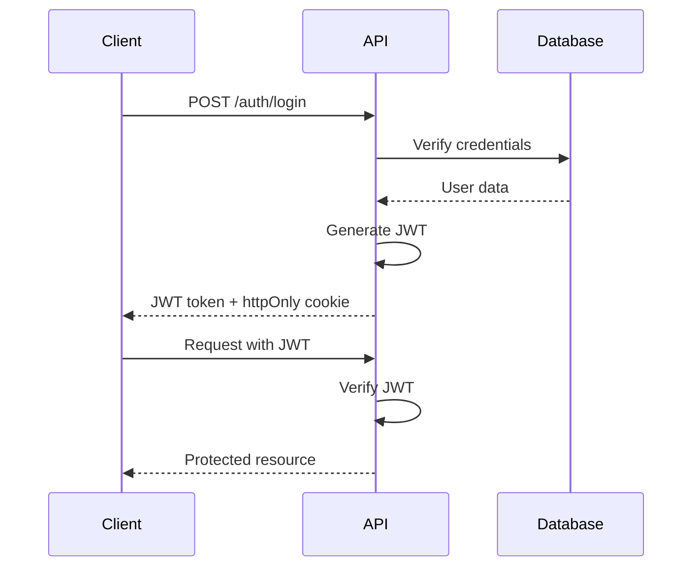

## System Components

PX47 is built as a distributed system with clear separation of concerns. The architecture follows a **producer-consumer pattern** with asynchronous job processing.


## Core Components

<CardGroup cols={2}>
  <Card title="Express API Server" icon="server">
    RESTful API handling authentication, pre-signed URL generation, and job queuing
  </Card>
  <Card title="BullMQ Workers" icon="gears">
    Independent worker processes that consume jobs from Redis queues
  </Card>
  <Card title="Redis" icon="database">
    In-memory data store for job queues and worker coordination
  </Card>
  <Card title="AWS S3" icon="aws">
    Object storage for raw and processed media files
  </Card>
  <Card title="MongoDB" icon="leaf">
    Persistent storage for user data, metadata, and processing status
  </Card>
  <Card title="FFmpeg/audiowaveform" icon="wand-magic-sparkles">
    Media processing tools for conversion and analysis
  </Card>
</CardGroup>

## Architecture Layers

### 1. API Layer

The Express.js API server handles all HTTP requests and authentication.

```javascript backend/routes/index.js
import { Router } from 'express';
import { AuthMiddleware } from '../middleware/auth.middleware.js';
import {
  generatePresignedUrl,
  fileUploadCompleted,
  getUserContent,
  getContentAccess,
} from '../controller/audioController.js';

const router = Router();

// Authentication routes
router.post('/auth/register', registerUser);
router.post('/auth/login', loginUser);

// Presigned URL generation
router.post('/generate-presigned-url/:fileName', 
  AuthMiddleware, 
  generatePresignedUrl
);

// Upload confirmation (triggers worker)
router.post('/fileUploaded/:audioId', 
  AuthMiddleware, 
  fileUploadCompleted
);

// Content retrieval
router.get('/contents', AuthMiddleware, getUserContent);
```

<Note>
  The API server never handles file uploads directly. It only generates pre-signed URLs and queues jobs.
</Note>

### 2. Service Layer

Services handle business logic and interact with repositories and job queues.

```javascript backend/services/audioService.js
import { WorkService } from '../jobs/index.js';
import AudioRepo from '../repository/audioRepository.js';

class AudioService {
  async fileUploaded(audioData, audioId, key, userId) {
    // Get the BullMQ audio queue
    const { audioQueue } = new WorkService().getQueues();
    
    // Add job to queue for worker processing
    await audioQueue.add('audio-processing', {
      audioId: audioId,
      s3Key: key,
      userId: userId,
    });
    
    // Update status to 'processing'
    audioData.userId = userId;
    const updatedData = await this.UpdateAudioService(
      audioData,
      audioId,
      userId,
    );
    
    return updatedData;
  }
}
```

<Info>
  Jobs are queued immediately and processed asynchronously, allowing instant API responses.
</Info>

### 3. Queue Layer

BullMQ manages job queues with Redis as the backing store.

```javascript backend/jobs/audioWorker.js
import { Queue, Worker } from 'bullmq';
import redis from '../config/redis.js';
import { audioPreprocessing } from '../pipeline/audioPipeline.js';

class AudioWorker {
  constructor() {
    this.redis = redis;
    this.queueName = 'audio-processing';
    
    // Create queue for adding jobs
    this.audioQueue = new Queue(this.queueName, {
      connection: this.redis,
    });
  }

  runAudioWorker() {
    // Create worker for consuming jobs
    const processAudio = new Worker(
      this.queueName,
      async (job) => await audioPreprocessing(job),
      { connection: this.redis }
    );

    processAudio.on('completed', (job) => {
      logger.info(`Audio processing completed | ${job.id}`);
    });

    processAudio.on('failed', (job, err) => {
      logger.error(`Audio processing failed | ${job.id} | ${err.message}`);
    });
  }
}
```

### 4. Processing Layer

Workers execute the actual media processing pipelines.

```javascript backend/pipeline/audioPipeline.js
import { AudioProcessing } from '../process/audioProcessing.js';
import { Bucket } from '../config/s3.js';

export async function audioPreprocessing(job) {
  const { s3Key, userId, audioId } = job.data;
  
  // Download from S3
  const s3 = new Bucket();
  const localpath = await s3.DownloadFromS3(s3Key);
  
  // Process audio
  const audio = new AudioProcessing(localpath);
  const mp3File = await audio.ConvertToMp3();
  const metadata = await audio.ExtractMetadata();
  const waveFormJson = await audio.ExtractWaveform();
  
  // Upload results back to S3
  const mp3Upload = await s3.UploadtoS3(mp3File, 'audio/mpeg', userId);
  const waveformUpload = await s3.UploadtoS3(
    waveFormJson, 
    'application/json', 
    userId
  );
  
  // Save metadata to database
  await SaveAudioMetadatatoDb(audioId, userId, {
    s3: {
      original: s3Key,
      mp3: mp3Upload.key,
      waveform: waveformUpload.key,
    },
    duration: Number(metadata.format.duration),
    sampleRate: Number(metadata.streams[0].sample_rate),
    status: 'ready',
  });
  
  // Cleanup local files
  await deleteLocalFile(localpath);
  await deleteLocalFile(mp3File);
  await deleteLocalFile(waveFormJson);
}
```

## Data Flow

<Steps>
  <Step title="Client Request">
    Client authenticates and requests a pre-signed URL for file upload
    
    ```bash
    POST /generate-presigned-url/audio.mp3
    Authorization: Bearer JWT_TOKEN
    ```
  </Step>

  <Step title="API Response">
    Server creates database record and generates pre-signed S3 URL
    
    ```json
    {
      "audioId": "clx123...",
      "url": "https://s3.amazonaws.com/...",
      "key": "user-uuid-audio.mp3"
    }
    ```
  </Step>

  <Step title="Direct S3 Upload">
    Client uploads file directly to S3 using the pre-signed URL (bypassing backend)
  </Step>

  <Step title="Upload Confirmation">
    Client confirms upload completion
    
    ```bash
    POST /fileUploaded/:audioId
    { "key": "user-uuid-audio.mp3" }
    ```
  </Step>

  <Step title="Job Queuing">
    Backend adds processing job to Redis queue and returns immediately
  </Step>

  <Step title="Worker Processing">
    Worker picks up job, downloads file, processes it, and uploads results
  </Step>

  <Step title="Status Update">
    Database is updated with processing results and status='ready'
  </Step>

  <Step title="Client Polling">
    Client fetches content to check processing status
    
    ```bash
    GET /contents
    ```
  </Step>
</Steps>

## Scalability Design

### Horizontal Scaling

<Accordion title="Multiple Workers">
  Run multiple worker processes to handle high processing volumes:

  ```bash
  # Terminal 1
  npm run worker

  # Terminal 2
  npm run worker

  # Terminal 3
  npm run worker
  ```

  BullMQ automatically distributes jobs across available workers.
</Accordion>

<Accordion title="API Server Clustering">
  Deploy multiple API server instances behind a load balancer:

  ```yaml docker-compose.yaml
  services:
    backend:
      build: ./backend
      deploy:
        replicas: 3
      ports:
        - "3000-3002:3000"
  ```
</Accordion>

<Accordion title="Redis Clustering">
  For production workloads, use Redis Cluster for high availability:

  ```javascript
  import Redis from 'ioredis';

  const redis = new Redis.Cluster([
    { host: 'redis-1', port: 6379 },
    { host: 'redis-2', port: 6379 },
    { host: 'redis-3', port: 6379 },
  ]);
  ```
</Accordion>

### Performance Optimizations

<CardGroup cols={2}>
  <Card title="Direct S3 Uploads" icon="bolt">
    Files never touch the backend server, reducing bandwidth and CPU usage
  </Card>
  <Card title="Async Processing" icon="clock">
    API responses are instant; processing happens in background
  </Card>
  <Card title="Parallel Workers" icon="gears">
    Multiple files can be processed simultaneously
  </Card>
  <Card title="Local Temp Files" icon="folder">
    FFmpeg requires local files; cleaned up after processing
  </Card>
</CardGroup>

## Security Architecture

### Authentication Flow



### Pre-signed URL Security

<Warning>
  Pre-signed URLs expire after 1 hour (configurable via `S3_EXPIRES` constant). Clients must use the URL before expiration.
</Warning>

```javascript backend/config/constants.js
export const S3_EXPIRES = 3600; // 1 hour in seconds
```

```javascript backend/config/s3.js
const url = await getSignedUrl(this.Client, command, {
  expiresIn: S3_EXPIRES,
});
```

## Technology Stack Details

<Tabs>
  <Tab title="Backend">
    - **Express.js 5.x**: Modern web framework
    - **BullMQ 5.x**: Redis-based queue system
    - **Prisma 6.x**: Type-safe ORM
    - **ioredis 5.x**: High-performance Redis client
    - **AWS SDK v3**: Modular S3 client
    - **Zod 4.x**: Schema validation
  </Tab>

  <Tab title="Processing">
    - **FFmpeg**: Video/audio encoding and transcoding
    - **FFprobe**: Metadata extraction
    - **audiowaveform**: Waveform generation
    - **Node.js child_process**: Spawn external tools
  </Tab>

  <Tab title="Infrastructure">
    - **Redis 7.x**: Job queue backing store
    - **MongoDB 6.x**: Document database
    - **S3-compatible storage**: AWS S3, MinIO, DigitalOcean Spaces
  </Tab>
</Tabs>

## Next Steps

<CardGroup cols={2}>
  <Card title="Workflow Details" icon="diagram-next" href="/architecture/workflow">
    Step-by-step processing workflow
  </Card>
  <Card title="Worker Architecture" icon="gears" href="/architecture/workers">
    Deep dive into BullMQ workers
  </Card>
  <Card title="Job Processing" icon="list-check" href="/concepts/job-processing">
    Understanding job lifecycle
  </Card>
  <Card title="Pipelines" icon="pipe" href="/concepts/pipelines">
    Audio and video processing pipelines
  </Card>
</CardGroup>
