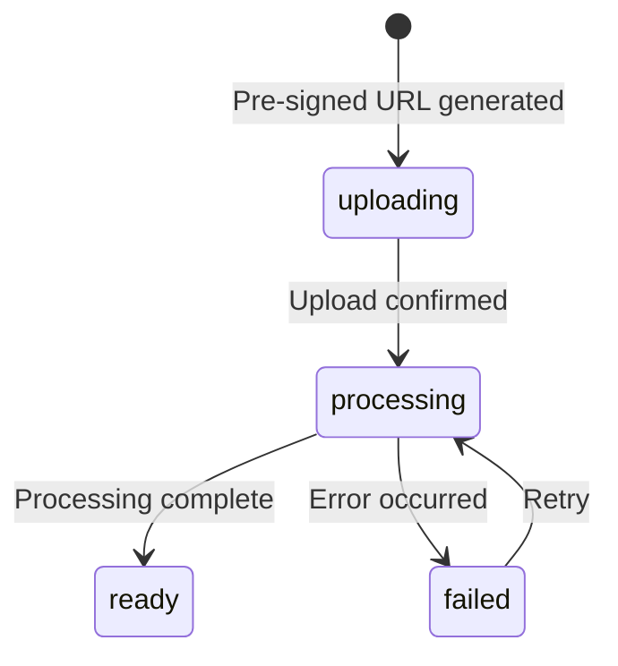

## Complete Workflow Overview

This page details the complete lifecycle of a media file from client upload through processing to final storage.

<Steps>
  <Step title="Pre-signed URL Request" icon="link">
    Client requests a pre-signed URL for S3 upload
  </Step>
  <Step title="Direct S3 Upload" icon="cloud-arrow-up">
    Client uploads file directly to S3
  </Step>
  <Step title="Worker Triggering" icon="bell">
    Backend queues job for worker processing
  </Step>
  <Step title="File Download" icon="download">
    Worker downloads file from S3 locally
  </Step>
  <Step title="Metadata Extraction" icon="file-search">
    FFprobe extracts media metadata
  </Step>
  <Step title="Format Conversion" icon="rotate">
    FFmpeg processes and converts media
  </Step>
  <Step title="Waveform Generation" icon="waveform">
    audiowaveform creates visualization data
  </Step>
  <Step title="S3 Upload" icon="cloud-arrow-up">
    Processed files uploaded back to S3
  </Step>
  <Step title="Database Update" icon="database">
    Metadata saved with status='ready'
  </Step>
  <Step title="Cleanup" icon="trash">
    Local temporary files deleted
  </Step>
</Steps>

## Detailed Audio Workflow

### Phase 1: Pre-signed URL Generation

<CodeGroup>
```javascript Controller (backend/controller/audioController.js)
export const generatePresignedUrl = async (req, res) => {
  const { fileName } = req.params;
  const s3 = new Bucket();

  // Generate pre-signed URL for S3 upload
  const objectStorage = await s3.CreatePresignedUrl(
    req.user.userId,
    fileName.toString(),
  );

  let audioData = {
    fileName: fileName,
    userId: req.user.userId,
    status: 'uploading',
  };

  // Create database record
  const metadata = await new AudioService().CreateAudioService(audioData);

  audioData = {
    ...audioData,
    audioId: metadata.id,
    objects: objectStorage,
  };

  successResponse(res, { audioData }, status.CREATED);
};
```

```javascript S3 Service (backend/config/s3.js)
async CreatePresignedUrl(userId, fileName) {
  const key = generateS3Key(userId, fileName);
  
  const command = new PutObjectCommand({
    Bucket: S3_BUCKET_NAME,
    Key: key,
  });
  
  // Generate pre-signed URL valid for 1 hour
  const url = await getSignedUrl(this.Client, command, {
    expiresIn: S3_EXPIRES, // 3600 seconds
  });
  
  return { url, key };
}
```
</CodeGroup>

<Info>
  The S3 key follows the pattern: `{userId}-{uuid}-{fileName}` for uniqueness and organization.
</Info>

### Phase 2: Client Upload

Client uploads file directly to S3 using the pre-signed URL:

```bash
curl -X PUT "https://s3.amazonaws.com/bucket/user-uuid-audio.mp3?X-Amz-..." \
  -H "Content-Type: audio/mpeg" \
  --data-binary "@audio.mp3"
```

<Note>
  The backend server **never receives the file data**, saving bandwidth and reducing latency.
</Note>

### Phase 3: Upload Confirmation & Job Queuing

```javascript Controller
export const fileUploadCompleted = async (req, res) => {
  const { audioId } = req.params;
  const { key } = req.body;
  
  let audioData = { status: 'processing' };
  
  // This queues the job to BullMQ
  const confirmation = await new AudioService().fileUploaded(
    audioData,
    audioId,
    key.trim(),
    req.user.userId,
  );
  
  successResponse(res, audioData, status.ACCEPTED);
};
```

```javascript Service (backend/services/audioService.js)
async fileUploaded(audioData, audioId, key, userId) {
  const { audioQueue } = new WorkService().getQueues();
  
  // Add job to Redis queue
  await audioQueue.add('audio-processing', {
    audioId: audioId,
    s3Key: key,
    userId: userId,
  });
  
  // Update status to 'processing'
  audioData.userId = userId;
  const updatedData = await this.UpdateAudioService(
    audioData,
    audioId,
    userId,
  );
  
  return updatedData;
}
```

<Tip>
  The API returns immediately after queuing the job. Processing happens asynchronously in the worker.
</Tip>

### Phase 4: Worker Processing

The worker picks up the job from the Redis queue:

```javascript Pipeline (backend/pipeline/audioPipeline.js)
export async function audioPreprocessing(job) {
  const { s3Key, userId, audioId } = jobMetadata(job);
  const s3 = new Bucket();
  
  // Step 1: Download from S3
  const localpath = await s3.DownloadFromS3(s3Key);
  
  const audio = new AudioProcessing(localpath);
  
  // Step 2: Convert to MP3
  logger.info('Starting ConvertToMp3...');
  const mp3File = await audio.ConvertToMp3();
  
  // Step 3: Extract metadata
  logger.info('Extracting metadata...');
  const metadata = await audio.ExtractMetadata();
  
  // Step 4: Generate waveform
  logger.info('Extracting waveform...');
  const waveFormJson = await audio.ExtractWaveform();
  
  // Step 5: Upload processed files
  const mp3Upload = await s3.UploadtoS3(mp3File, 'audio/mpeg', userId);
  const waveformUpload = await s3.UploadtoS3(
    waveFormJson,
    'application/json',
    userId,
  );
  
  // Step 6: Save metadata
  await SaveAudioMetadatatoDb(audioId, userId, {
    s3: {
      original: s3Key,
      mp3: mp3Upload.key,
      waveform: waveformUpload.key,
    },
    duration: Number(metadata.format.duration),
    sampleRate: Number(metadata.streams[0].sample_rate),
    bitRate: Number(metadata.format.bit_rate),
    channels: Number(metadata.streams[0].channels),
    codec: metadata.streams[0].codec_name,
    status: 'ready',
  });
  
  // Step 7: Cleanup
  await deleteLocalFile(localpath);
  await deleteLocalFile(mp3File);
  await deleteLocalFile(waveFormJson);
  
  return {
    metadata,
    mp3Url: mp3Upload.key,
    waveformUrl: waveformUpload.key,
  };
}
```

### Phase 5: Audio Processing Details

<Tabs>
  <Tab title="MP3 Conversion">
    ```javascript backend/process/audioProcessing.js
    ConvertToMp3() {
      const outputPath = generateOutputFile(this.inputPath, 'mp3');
      
      return new Promise((resolve, reject) => {
        const mp3Conversion = spawn('ffmpeg', [
          '-i', this.inputPath,
          '-ac', '2',              // 2 channels (stereo)
          '-b:a', '128k',          // 128 kbps bitrate
          '-ar', '44100',          // 44.1 kHz sample rate
          '-codec:a', 'libmp3lame', // MP3 codec
          outputPath,
        ]);
        
        mp3Conversion.on('close', (code) => {
          if (code === 0) {
            resolve(outputPath);
          } else {
            reject(new Error(`FFmpeg exited with code ${code}`));
          }
        });
      });
    }
    ```

    <Info>
      Audio conversion settings are configurable in `backend/config/constants.js`:
      - **CODEC**: `libmp3lame`
      - **BITRATE**: `128k`
      - **CHANNELS**: `2` (stereo)
      - **SAMPLERATE**: `44100` Hz
    </Info>
  </Tab>

  <Tab title="Metadata Extraction">
    ```javascript backend/process/audioProcessing.js
    ExtractMetadata = () => {
      return new Promise((resolve, reject) => {
        let data = '';
        
        const ffprobe = spawn('ffprobe', [
          '-v', 'quiet',
          '-print_format', 'json',
          '-show_format',
          '-show_streams',
          this.inputPath,
        ]);
        
        ffprobe.stdout.on('data', (chunk) => {
          data += chunk.toString();
        });
        
        ffprobe.on('close', (code) => {
          if (code === 0) {
            resolve(JSON.parse(data));
          } else {
            reject(new Error(`ffprobe exited with code ${code}`));
          }
        });
      });
    };
    ```

    **Extracted metadata includes:**
    - Duration
    - Sample rate
    - Bit rate
    - Channels
    - Codec name
    - Format details
  </Tab>

  <Tab title="Waveform Generation">
    ```javascript backend/process/audioProcessing.js
    ExtractWaveform() {
      const outputPath = generateOutputFile(this.inputPath, 'json');
      
      return new Promise((resolve, reject) => {
        const waveFormMetadata = spawn('audiowaveform', [
          '-i', this.inputPath,
          '-o', outputPath,
          '--pixels-per-second', '10', // 10 PPS
          '-b', '8',                    // 8-bit precision
        ]);
        
        waveFormMetadata.on('close', (code) => {
          if (code === 0) {
            resolve(outputPath);
          } else {
            reject(new Error(`Waveform generation failed`));
          }
        });
      });
    }
    ```

    <Note>
      Waveform settings:
      - **PPS**: 10 pixels per second
      - **BIT**: 8-bit precision
      - Output format: JSON
    </Note>
  </Tab>
</Tabs>

## Video Processing Workflow

Video processing follows a similar workflow with additional steps:

<Steps>
  <Step title="Download from S3">
    Worker downloads the original video file locally
  </Step>

  <Step title="Extract Metadata">
    FFprobe extracts video and audio stream metadata:
    - Video: codec, resolution, fps, aspect ratio, color space
    - Audio: codec, sample rate, channels, bit rate
  </Step>

  <Step title="Extract Audio Track">
    ```javascript backend/process/videoProcessing.js
    ExtractAudiofromVideo() {
      const outputFile = generateOutputFile(this.inputPath, 'm4a');
      
      return new Promise((resolve, reject) => {
        const audioData = spawn('ffmpeg', [
          '-y',
          '-i', this.inputPath,
          '-vn',              // No video
          '-acodec', 'copy',  // Copy audio codec
          outputFile,
        ]);
        
        audioData.on('close', (code) => {
          if (code == 0) {
            resolve(outputFile);
          }
        });
      });
    }
    ```
  </Step>

  <Step title="Generate Mute Video">
    ```javascript backend/process/videoProcessing.js
    ExtractMuteVideo() {
      const outputFile = generateOutputFile(this.inputPath);
      
      return new Promise((resolve, reject) => {
        const audioData = spawn('ffmpeg', [
          '-y',
          '-i', this.inputPath,
          '-an',              // No audio
          '-vcodec', 'copy',  // Copy video codec
          outputFile,
        ]);
        
        audioData.on('close', (code) => {
          if (code == 0) {
            resolve(outputFile);
          }
        });
      });
    }
    ```
  </Step>

  <Step title="Upload Results">
    Both audio and mute video files are uploaded to S3
  </Step>

  <Step title="Save Metadata">
    Comprehensive metadata saved to database:
    ```javascript
    await SaveVideoMetadatatoDb(videoId, userId, {
      s3: {
        originalKey: s3Key,
        video: muteVideoUpload.key,
        audio: audioFileKey || null,
      },
      has_audio: hasAudio,
      audioId: audioEntry?.id ?? null,
      format_name: metadata.format.format_name,
      duration: Number(metadata.format.duration),
      bit_rate: Number(metadata.format.bit_rate),
      codec: videoStream?.codec_name,
      width: Number(videoStream?.width),
      height: Number(videoStream?.height),
      fps: parseFps(videoStream?.avg_frame_rate),
      aspect_ratio: videoStream?.display_aspect_ratio,
      color_space: videoStream?.color_space,
      status: 'ready',
    });
    ```
  </Step>
</Steps>

<Warning>
  If a video has no audio track, the `audioId` and `audio` S3 key will be `null`.
</Warning>

## Error Handling

### Worker Error Recovery

```javascript backend/jobs/audioWorker.js
processAudio.on('failed', (job, err) => {
  logger.error(`Audio processing failed | ${job.id} | ${err.message}`);
});
```

BullMQ automatically retries failed jobs based on configuration:

```javascript
const job = await audioQueue.add('audio-processing', data, {
  attempts: 3,
  backoff: {
    type: 'exponential',
    delay: 2000,
  },
});
```

### Cleanup on Failure

```javascript backend/pipeline/videoPipeline.js
try {
  // Processing logic...
} catch (error) {
  // Cleanup local files even on failure
  await deleteLocalFile(localPath);
  await deleteLocalFile(muteVideo);
  await deleteLocalFile(extractedAudio);
  
  logger.error(`Video preprocessing error | job=${job.id} | ${error.message}`);
  throw error;
}
```

## Status Transitions

<Steps>
  <Step title="uploading">
    Initial status when pre-signed URL is generated
  </Step>
  <Step title="processing">
    Set when upload is confirmed and job is queued
  </Step>
  <Step title="ready">
    Final status after successful processing
  </Step>
  <Step title="failed" icon="x">
    Set if processing encounters an unrecoverable error
  </Step>
</Steps>



## Performance Considerations

<CardGroup cols={2}>
  <Card title="Parallel Workers" icon="gears">
    Multiple workers can process different files simultaneously
  </Card>
  <Card title="Local Processing" icon="hard-drive">
    FFmpeg requires local files; temp directory cleaned after processing
  </Card>
  <Card title="Streaming Downloads" icon="download">
    S3 downloads stream to disk to handle large files
  </Card>
  <Card title="Atomic Uploads" icon="cloud-arrow-up">
    S3 uploads are atomic; files appear only when complete
  </Card>
</CardGroup>

<Tip>
  The temp directory is created at `backend/temp-disk/` and is automatically cleaned up after each job.
</Tip>

## Next Steps

<CardGroup cols={2}>
  <Card title="Worker Architecture" icon="gears" href="/architecture/workers">
    Deep dive into BullMQ worker configuration
  </Card>
  <Card title="Processing Pipelines" icon="pipe" href="/concepts/pipelines">
    Detailed pipeline implementation
  </Card>
  <Card title="Job Processing" icon="list-check" href="/concepts/job-processing">
    BullMQ job lifecycle and queue management
  </Card>
  <Card title="S3 Integration" icon="aws" href="/concepts/s3-integration">
    Pre-signed URLs and S3 operations
  </Card>
</CardGroup>
